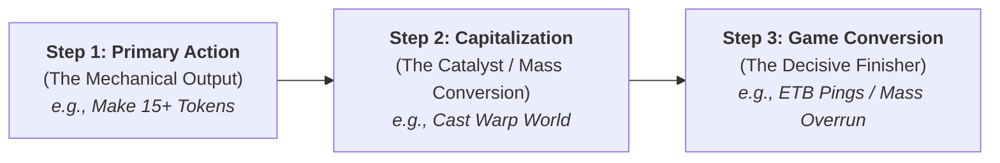

# Commander Deck Shape Reference Guide: Engineering High-Synergy Powerhouses

> **Source Material:** Based on the architectural deckbuilding methodology presented by Gauge (*Commander Challenge*) in *"Turn Any Deck Into a Power House (by fixing it's shape)"* ([YouTube Video](https://www.youtube.com/watch?v=xZvaBPrF56E)).  
> **Companion Visual Dashboard:** [`DeckShapeReferenceGuide.html`](DeckShapeReferenceGuide.html)  
> **Core Companion Standard:** [`COMMANDER_TEMPLATE.md`](COMMANDER_TEMPLATE.md) (Card Ratios) & [`COMMANDER_DECKBUILDING_RULES.md`](COMMANDER_DECKBUILDING_RULES.md) (Bracket System).

---

## 1. Executive Summary & Core Philosophy

One of the most common pitfalls in Commander deckbuilding is attempting to fix an underperforming deck by simply buying expensive generic staples (*Sylvan Library*, *Rhystic Study*, *Ancient Copper Dragon*, *Old Gnawbone*). While powerful, generic bombs do not fix fundamental structural flaws.

```
   TRADITIONAL MISTAKE:                     THE SHAPE FRAMEWORK:
┌───────────────────────────┐            ┌───────────────────────────┐
│ Sluggish / Clunky Deck    │            │ Sluggish / Clunky Deck    │
│            ▼              │            │            ▼              │
│ Add $50+ Generic Staples  │            │ Diagnose Internal Shape   │
│            ▼              │            │            ▼              │
│ Still Inconsistent & Slow │            │ Align with Commander Role │
│ (Now Just More Expensive) │            │            ▼              │
└───────────────────────────┘            │ High-Synergy $1-$3 Engine │
                                         │            ▼              │
                                         │ Bracket 3/4 Powerhouse    │
                                         └───────────────────────────┘
```

### The Core Thesis
1. **You do not need expensive cards to build a Bracket 3 or 4 powerhouse.** Consistency and velocity stem from how card categories interact internally.
2. **Brackets 3 and 4 have an unmistakable, proactive path to victory.** While Bracket 2 decks often muddle into accidental wins through generic board stalls, optimized decks formulate a crystal-clear 3-step objective.
3. **Internal geometry dictates performance.** Every deck possesses an internal structure formed by **Generators**, **Amplifiers**, and **Payoffs**, supported by **Three Pillars of Advantage** (Card Advantage, Mana Advantage, Board State Advantage).
4. **The Commander Subtraction Principle:** Because your commander is an 8th card in hand with guaranteed accessibility in the command zone, you must **reduce that exact category within the 99** to eliminate dead draws and maximize synergy density.

---

## 2. The 3-Step Keystone Framework: Formulating a Clear Objective

To elevate any deck into Bracket 3 or 4, you must define its **Keystone Objective** across three distinct sequential phases:



### Step 1: The Primary Action (The Mechanical Engine)
Identify the singular mechanical action your deck executes repeatedly. Without this action, the deck does nothing.
- *Examples:* Generating artifact/creature tokens, placing +1/+1 counters, self-milling creature cards, triggering landfall, cascading into low-cost spells.
- *Wilson Case Study:* Creating a critical mass of tokens (Treasures, Food, Clues, Thopters, Frogs) via Wilson's combat triggers and low-cost token engines.

### Step 2: Capitalization (The Catalyst / Intermediate Pivot)
How does your deck convert that mass mechanical output into an overwhelming resource or board state advantage?
- *Examples:* Casting [Warp World](https://scryfall.com/card/m10/163/warp-world?utm_source=api) ({5}{R}{R}{R}) or [Living Death](https://scryfall.com/card/cmd/88/living-death?utm_source=api) ({3}{B}{B}).
- *The Mechanics Trap:* Counting **permanents**, not cards. Token generators allow cards like [Warp World](https://scryfall.com/card/m10/163/warp-world?utm_source=api), [Glimpse of Tomorrow](https://scryfall.com/card/mh2/129/glimpse-of-tomorrow?utm_source=api), and [Over the Top](https://scryfall.com/card/bro/146/over-the-top?utm_source=api) to shuffle 20–30 dinky tokens and flip 20–30 real permanent cards directly onto the battlefield.

### Step 3: Game Conversion (The Finisher / Insurmountable Lead)
Mass capitalization spells do not win the game on their own. You must pack specific cards that trigger or activate upon that mass arrival to end the game immediately or make victory inevitable.
- *Wilson Case Study:* Flipping 25 cards into [Ingenious Artillerist](https://scryfall.com/card/clb/182/ingenious-artillerist?utm_source=api) ({2}{R}) deals 20+ direct damage to every opponent; [Displaced Dinosaurs](https://scryfall.com/card/who/100/displaced-dinosaurs?utm_source=api) ({5}{G}{G}) turns every entering token into a 7/7 Dinosaur; [Depthshaker Titan](https://scryfall.com/card/eoc/9/depthshaker-titan?utm_source=api) ({5}{R}{R}) animates noncreature artifacts into 3/3s with Melee, Trample, and Haste; [Biotech Specialist](https://scryfall.com/card/eoe/214/biotech-specialist?utm_source=api) ({R}{G}) deals 2 damage per sacrificed artifact as you crack free Treasures.

---

## 3. The Four Functional Card Roles

Every nonland card in your Commander deck belongs to one of four functional roles:

| Role | Definition | Diagnostic Test | Examples |
| :--- | :--- | :--- | :--- |
| **Generators** | The base engine. Performs the raw mechanic of the deck. | *"Without these cards, does my deck literally do nothing?"* | Token creators, counter placers, self-millers, cantrip spells. |
| **Amplifiers** | Force multipliers. They do not initiate the mechanic, but make generators produce exponentially more. | *"Does this card do nothing in an empty board, but double or supercharge my generators?"* | Token doublers ([Peregrin Took](https://scryfall.com/card/ltr/181/peregrin-took?utm_source=api)), evasion gear ([Brotherhood Regalia](https://scryfall.com/card/acr/71/brotherhood-regalia?utm_source=api)), Myriad granters ([Duke Ulder Ravengard](https://scryfall.com/card/clb/272/duke-ulder-ravengard?utm_source=api)). |
| **Payoffs** | Game closers. Converts a built board state into an immediate win or insurmountable advantage. | *"If I play this with a full board, do my opponents die or concede?"* | [Jetmir, Nexus of Revels](https://scryfall.com/card/snc/193/jetmir-nexus-of-revels?utm_source=api), [Overrun](https://scryfall.com/card/cma/130/overrun?utm_source=api) effects, [Warp World](https://scryfall.com/card/m10/163/warp-world?utm_source=api), [Ingenious Artillerist](https://scryfall.com/card/clb/182/ingenious-artillerist?utm_source=api). |
| **Advantage Gainers** | The support infrastructure. Keeps the engine fueled and protected across the Three Pillars. | *"Does this provide card velocity, mana acceleration, or board protection?"* | Card draw, mana ramp, targeted removal, board sweepers, countermagic, hexproof protection. |

---

## 4. The 4 Geometric Deck Shapes & The Commander Subtraction Principle

### The Commander Subtraction Principle
Your Commander resides in the Command Zone. You have 100% reliability of drawing and casting it every single game. Therefore:
> **MANDATORY RULE:** Identify which of the 4 roles your Commander fills, then **REDUCE** that exact category within your 99. Adding redundant cards that duplicate what your Commander already guarantees creates clunky, inefficient hands.

```mermaid
graph TD
    subgraph S1["Shape 1: The Diamond"]
        D_Gen["Lean Generators (Commander guarantees generation)"]
        D_Amp["Maximized Amplifiers (Bulging Midsection)"]
        D_Pay["Focused Payoffs (3-5 Finishers)"]
        D_Gen --> D_Amp --> D_Pay
    end
    subgraph S2["Shape 2: The Inverted Triangle (T-Shape)"]
        T_Gen["Massive Generator Suite (Wide Top)"]
        T_Amp["Near-Zero Amplifiers (Commander is the Amplifier)"]
        T_Pay["Focused Payoffs"]
        T_Gen --> T_Amp --> T_Pay
    end
    subgraph S3["Shape 3: The Pointed Rectangle"]
        R_Gen["High Generators"]
        R_Amp["High Amplifiers"]
        R_Pay["Zero 99 Payoffs (Commander IS the Win-Con)"]
        R_Gen --> R_Amp --> R_Pay
    end
```



---

### Shape 1: The Diamond (Commander is a Generator)
* **Archetype Commanders:** [Wilson, Refined Grizzly](https://scryfall.com/card/clb/261/wilson-refined-grizzly?utm_source=api) + [Guild Artisan](https://scryfall.com/card/clb/179/guild-artisan?utm_source=api), [Sorin of House Markov](https://scryfall.com/card/mh3/245/sorin-of-house-markov-sorin-ravenous-neonate?utm_source=api), [Krenko, Tin Street Kingpin](https://scryfall.com/card/moc/287/krenko-tin-street-kingpin?utm_source=api), [Lotho, Corrupt Shirriff](https://scryfall.com/card/ltr/213/lotho-corrupt-shirriff?utm_source=api).
* **The Structural Flaw:** Most players pack 25+ generators in the 99 alongside a generator commander. This results in hands full of redundant, low-impact token makers that clog the board without scaling.
* **The Correction:**
  - **Reduce Generators in the 99:** Keep only high-velocity or landfall generators ([Tireless Tracker](https://scryfall.com/card/pip/206/tireless-tracker?utm_source=api)). Cut slow, top-heavy generators ([Bootleggers' Stash](https://scryfall.com/card/snc/134/bootleggers-stash?utm_source=api), [Old Gnawbone](https://scryfall.com/card/afr/197/old-gnawbone?utm_source=api)).
  - **Maximize Amplifiers:** Flood the deck with cards that make your commander swing cleanly and produce 2x–4x output ([Brotherhood Regalia](https://scryfall.com/card/acr/71/brotherhood-regalia?utm_source=api), [Trailblazer's Boots](https://scryfall.com/card/otc/269/trailblazers-boots?utm_source=api), [The Reaver Cleaver](https://scryfall.com/card/dmc/8/the-reaver-cleaver?utm_source=api), [Peregrin Took](https://scryfall.com/card/ltr/181/peregrin-took?utm_source=api), [Quina, Qu Gourmet](https://scryfall.com/card/fin/194/quina-qu-gourmet?utm_source=api)).
  - **Result:** The deck forms a **Diamond** — narrow generators, bulging amplifier core, focused top payoffs.

---

### Shape 2: The Inverted Triangle / T-Shape (Commander is an Amplifier)
* **Archetype Commanders:** [Duke Ulder Ravengard](https://scryfall.com/card/clb/272/duke-ulder-ravengard?utm_source=api) (grants Myriad to ETBs), [Roaming Throne](https://scryfall.com/card/lci/258/roaming-throne?utm_source=api), [Isshin, Two Heavens as One](https://scryfall.com/card/neo/224/isshin-two-heavens-as-one?utm_source=api), [Veyran, Voice of Duality](https://scryfall.com/card/c21/3/veyran-voice-of-duality?utm_source=api).
* **The Structural Flaw:** Running too many passive buff cards and static doublers (*Panharmonicon*, *Strionic Resonator*). When your commander is removed or you draw multiple amplifiers with no creatures to trigger them, your deck grinds to a complete halt.
* **The Correction:**
  - **Eliminate Most 99 Amplifiers:** Your commander is already the force multiplier.
  - **Maximize High-Quality Generators:** Pack the 99 with the most versatile, high-impact ETB or attack creatures available.
  - **Result:** An **Inverted Triangle (T-Shape)** — a wide top tier of diverse generators, tapering down to a single central amplifier in the Command Zone.

---

### Shape 3: The Pointed Rectangle (Commander is a Payoff)
* **Archetype Commanders:** [Jetmir, Nexus of Revels](https://scryfall.com/card/snc/193/jetmir-nexus-of-revels?utm_source=api) (team Vigilance, Trample, Double Strike), [Craterhoof Behemoth](https://scryfall.com/card/cmm/280/craterhoof-behemoth?utm_source=api) in the command zone, [Syr Konrad, the Grim](https://scryfall.com/card/mkc/141/syr-konrad-the-grim?utm_source=api), [Thromok the Insatiable](https://scryfall.com/card/pca/106/thromok-the-insatiable?utm_source=api).
* **The Structural Flaw:** Dedicating 6–8 slots in the 99 to expensive overrun spells (*Triumph of the Hordes*, *Overwhelming Stampede*). These sit dead in hand while you struggle to build creature density.
* **The Correction:**
  - **Cut 99 Payoffs to Zero (or 1-2 Max):** Your finisher is in the Command Zone at all times.
  - **Maximize Generators & Cheap Amplifiers:** Focus 100% of your non-pillar slots on building the requisite board threshold (e.g., hitting 9 creatures for Jetmir's lethal double-strike threshold).
  - **Result:** A **Pointed Rectangle** — solid, uniform columns of generators and enablers terminating at a sharp point in the Command Zone.

---

### Shape 4: The Pillar-Shifted Engine (Commander is an Advantage Gainer)
* **Archetype Commanders:**
  - *Card Advantage:* [Sythis, Harvest's Hand](https://scryfall.com/card/cmm/938/sythis-harvests-hand?utm_source=api), [Tatyova, Benthic Druid](https://scryfall.com/card/lcc/290/tatyova-benthic-druid?utm_source=api), [Korvold, Fae-Cursed King](https://scryfall.com/card/eld/329/korvold-fae-cursed-king?utm_source=api).
  - *Mana Advantage:* [Urza, Lord High Artificer](https://scryfall.com/card/cmm/130/urza-lord-high-artificer?utm_source=api), [Selvala, Heart of the Wilds](https://scryfall.com/card/cmm/320/selvala-heart-of-the-wilds?utm_source=api), [Omnath, Locus of Mana](https://scryfall.com/card/cmm/310/omnath-locus-of-mana?utm_source=api).
  - *Board State / Interaction:* [Sarulf, Realm Eater](https://scryfall.com/card/khm/228/sarulf-realm-eater?utm_source=api), [Marchesa, the Black Rose](https://scryfall.com/card/2x2/241/marchesa-the-black-rose?utm_source=api).
* **The Correction:**
  - Subtract slots directly from that commander's advantage pillar in the 99. If your commander draws cards on every basic action (Sythis, Tatyova), you do not need 12 standalone draw spells in the 99. Reduce draw spells to 4–6 and reallocate those slots into cheap 1-mana generators and protection.

---

## 5. Upgrading the Three Pillars via High-Synergy Architecture

The Three Pillars of Advantage support the internal shape of your deck:
1. **Pillar 1: Card Advantage**
2. **Pillar 2: Mana Advantage**
3. **Pillar 3: Board State Advantage (Interaction & Protection)**

Upgrading these pillars via **High-Synergy Alignment** is the fastest way to increase deck power while dramatically reducing budget.

```
       ┌────────────────────────────────────────────────────────┐
       │               THE CORE ENGINE SHAPE                    │
       │         (Generators ── Amplifiers ── Payoffs)          │
       └────────────────────────────────────────────────────────┘
             │                     │                     │
      ┌──────────────┐      ┌──────────────┐      ┌──────────────┐
      │   PILLAR 1   │      │   PILLAR 2   │      │   PILLAR 3   │
      │ Card Velocity│      │Mana Advantage│      │ Board State  │
      │(High-Synergy)│      │(High-Synergy)│      │(Suppression &│
      │              │      │              │      │  Protection) │
      └──────────────┘      └──────────────┘      └──────────────┘
```

---

### Pillar 1: Card Advantage — "High-Synergy Dig" vs. Generic Staples

Generic card advantage (*Sylvan Library*, *Rhystic Study*, *Esper Sentinel*) is universally demanded, driving up financial cost. However, in an engine-driven deck, **High-Synergy Dig** outperforms generic draw at a fraction of the price.

* **What is High-Synergy Dig?** Combining your deck's primary mechanical action with cards that convert that specific resource into massive card velocity.
* **The Wilson Token Case Study:**
  - Cutting [Sylvan Library](https://scryfall.com/card/dmr/179/sylvan-library?utm_source=api) ($25+) and [Shamanic Revelation](https://scryfall.com/card/ncc/311/shamanic-revelation?utm_source=api) (clunky 5-mana sorcery that whiffs on noncreature tokens).
  - Adding [Quicksmith Genius](https://scryfall.com/card/c21/178/quicksmith-genius?utm_source=api) ({2}{R}): Whenever an artifact enters, loot. In a token storm deck, this churns through 15+ cards per turn.
  - Adding [Sarinth Steelseeker](https://scryfall.com/card/bro/189/sarinth-steelseeker?utm_source=api) ({1}{G}): Whenever an artifact enters, look at the top card; put lands into hand, or graveyard/topdeck nonlands.
  - Adding [Heroes for Hire](https://scryfall.com/card/msc/688/heroes-for-hire?utm_source=api) ({3}{R}{R}): Enters with 3 Treasures, then allows you to sacrifice any Treasure to impulse-draw off the top. With 8 Treasures out, you dig 8 cards deep on demand.
  - Adding [Idol of Oblivion](https://scryfall.com/card/tdc/319/idol-of-oblivion?utm_source=api) ({2}): Tap to draw a card if you created a token this turn. Unconditional 1-mana repeatable card engine.
  - Adding [Technodrome](https://scryfall.com/card/tmt/179/technodrome?utm_source=api) ({2}): Tap, sacrifice an artifact: draw a card and grow.

---

### Pillar 2: Mana Advantage — The Three Tiers of Ramp

Do not view mana advantage as simply "10 signets and land fetchers." True high-power decks utilize three tiers:

```
TIER 1: Basic Ramp          → Gets you 1 turn ahead of the curve (Arcane Signet, Farseek, Three Visits).
TIER 2: Explosive Ramp      → Produces a massive single-turn burst of mana (Jeska's Will, Mana Geyser).
TIER 3: High-Synergy Engine → Turns the deck's primary mechanic into continuous, scaling mana every turn.
```

* **High-Synergy Mana Engines:**
  - [Inspiring Statuary](https://scryfall.com/card/mkc/230/inspiring-statuary?utm_source=api) ({3}): Gives all nonartifact spells Improvise. Turns every Treasure, Clue, Food, and Thopter into permanent untapped mana without sacrificing them.
  - [Night of the Sweets' Revenge](https://scryfall.com/card/woe/178/night-of-the-sweets-revenge?utm_source=api) ({3}{G}): Makes a Food on entry, turns all Food into green mana dorks, and later sacrifices to Overrun the table.
  - [Roxanne, Starfall Savant](https://scryfall.com/card/otj/228/roxanne-starfall-savant?utm_source=api) ({3}{R}{G}): Enters and attacks creating tapped Meteorites (spot damage + ramp), while passively doubling all mana produced by artifact tokens.

---

### Pillar 3: Board State Advantage — Interaction & Protection

Most deckbuilders simply count "12 spot removal spells." Modern Commander demands a more nuanced approach based on two strategic criteria:

#### Criterion A: Deck Velocity & Natural Resilience
- **Explosive, Resilient Decks Need Less Removal:** If your deck wins suddenly in one turn and its engine pieces are naturally protected (e.g., Wilson has Ward {2}; tokens/artifacts are immune to creature board wipes), you can safely trim generic removal down to 6–8 pieces.
- **Slower, Fragile Decks Need More Removal:** If your strategy relies on vulnerable utility creatures that must survive multiple turn cycles, you must pack 12–15 interaction spells to suppress faster opponents.

#### Criterion B: Threat Perception (Suppression vs. Protection Ratio)
- **Are you the Archenemy?** If your deck aggressively develops a terrifying board, opponents will target you. Skew heavily toward **Protection** ([Heroic Intervention](https://scryfall.com/card/cmm/295/heroic-intervention?utm_source=api), [Teferi's Protection](https://scryfall.com/card/2x2/32/teferis-protection?utm_source=api), [Flawless Maneuver](https://scryfall.com/card/cmm/24/flawless-maneuver?utm_source=api), Phasing, Ward).
- **Do you Fly Under the Radar?** If your deck quietly accumulates incremental value, run **Suppression** (instant-speed exile, catch-all removal like [Beast Within](https://scryfall.com/card/msc/169/beast-within?utm_source=api)) to eliminate opposing combo pieces while you assemble your engine.

#### Criterion C: "The Cyclonic Rift Effect" (Game-Ending Sweepers)
Do not play symmetrical board wipes that set you back to square one alongside your opponents. Look for wipes that leverage your specific board state to establish an insurmountable game-ending lead:
- [The Great Aurora](https://scryfall.com/card/ori/179/the-great-aurora?utm_source=api) ({6}{G}{G}{G}): Shuffles all permanents and hands into libraries, draws that many cards, and puts all lands onto the battlefield. In a deck with 25+ tokens, you draw 35+ cards and put 15–20 lands into play untapped, while opponents are left with 4–6 lands and an empty board.
- [Reckless Endeavor](https://scryfall.com/card/afc/33/reckless-endeavor?utm_source=api) ({5}{R}{R}): Sweeps the table of creatures while simultaneously generating 5–12 Treasure tokens to accelerate into your next turn.
- [Ezuri's Predation](https://scryfall.com/card/clb/824/ezuris-predation?utm_source=api) ({5}{G}{G}{G}): Destroys small/medium opposing armies while creating an army of 4/4 Beasts.

---

## 6. Goldfish Simulation Calibration & Pod Friction

When testing decks using `scripts/multiplayer_goldfish.py`, calibrate your goldfish benchmarks against the Commander Bracket System:

| Bracket | Target Turn to Present Win / Lock | Goldfish Simulation Benchmark | Table Friction Adjustment |
| :---: | :---: | :---: | :---: |
| **Bracket 1** | Turn 10+ | Turn 9–10 | Casual pod dynamics, low interaction. |
| **Bracket 2** | Turn 8–9 | Turn 7–8 | Moderate spot removal, occasional wipes. |
| **Bracket 3** | Turn 6–7 | **Turn 5–6** | Subtract 1 turn for pod friction (targeted removal, blockers). |
| **Bracket 4** | Turn 4–5 | **Turn 3–4** | Fast interaction, free counterspells, stax pieces. |
| **Bracket 5** | Turn 1–3 | Turn 1–2 | cEDH interaction stack battles. |

### Accounting for Real-World Pod Friction
In goldfishing, Wilson + Guild Artisan presents a win on **Turn 5 or Turn 6**. In real paper games:
1. Guild Artisan requires attacking the player with the *most* life. Opponents will hold up blockers or kill spells on Wilson.
2. Opponents cast board wipes and interaction.
3. This combat and political friction naturally delays the deck by 1–2 turns, placing it firmly and consistently into **Bracket 3 (Turn 6–7 win presentation)**.

---

## 7. The 7-Step Deck Diagnosis & Reshaping Checklist

Use this diagnostic protocol whenever building a new deck or fixing a clunky existing build:

- [ ] **1. Define the 3-Step Keystone:** Can you state your Primary Action, your Capitalization Spell, and your Win Conversion card in one sentence?
- [ ] **2. Classify Your Commander:** Is your commander a Generator, Amplifier, Payoff, or Advantage Gainer?
- [ ] **3. Apply the Subtraction Rule:** Have you reduced the Commander's category within the 99?
- [ ] **4. Check the Geometry:** Does the ratio of Generators to Amplifiers match the commander's shape (Diamond, Inverted Triangle, Pointed Rectangle)?
- [ ] **5. Audit for High-Synergy Dig:** Have you replaced generic, expensive draw spells with engines that trigger directly off your Primary Action?
- [ ] **6. Upgrade Mana Advantage:** Does your ramp suite include at least 2–3 High-Synergy continuous mana engines (e.g., Improvise, token double-mana)?
- [ ] **7. Calibrate Board Advantage:** Is your interaction suite tailored to your deck's threat level (Protection vs. Removal), and does it include at least one asymmetrical game-ending sweeper?

---

## 8. Verified Card Reference Gallery

Below are the verified card specifications and visual renders for all key archetype cards referenced in this guide:

<div align="center">

### Core Archetype Engines
<p float="left">
  <a href="https://scryfall.com/card/clb/261/wilson-refined-grizzly?utm_source=api"></a>
  <a href="https://scryfall.com/card/clb/179/guild-artisan?utm_source=api"></a>
  <a href="https://scryfall.com/card/m10/163/warp-world?utm_source=api"></a>
</p>

### High-Synergy Dig & Advantage
<p float="left">
  <a href="https://scryfall.com/card/c21/178/quicksmith-genius?utm_source=api"></a>
  <a href="https://scryfall.com/card/bro/189/sarinth-steelseeker?utm_source=api"></a>
  <a href="https://scryfall.com/card/tdc/319/idol-of-oblivion?utm_source=api"></a>
</p>

### Win-Con Converters & Finishers
<p float="left">
  <a href="https://scryfall.com/card/clb/182/ingenious-artillerist?utm_source=api"></a>
  <a href="https://scryfall.com/card/who/100/displaced-dinosaurs?utm_source=api"></a>
  <a href="https://scryfall.com/card/ori/179/the-great-aurora?utm_source=api"></a>
</p>

</div>

---

## 9. Integration with Repository Rules

1. **Relation to `COMMANDER_TEMPLATE.md`:** The "New Era" template provides our target ratio counts (38 Lands, 10 Ramp, 12 Draw, 12 Removal, 6 Sweepers, 31 Plan). Use the **Deck Shape Framework** to dynamically adjust these counts based on your Commander's classification and high-synergy density.
2. **User Preference Ban Compliance:** The Deck Shape framework fully enforces zero filter lands (*Shadowblood Ridge*, *Desolate Mire*) and zero filter rocks (*Signets*) per user rules in `GEMINI.md`. All mana acceleration is achieved via basic ramp, crowd lands, fetch/shock targets, and High-Synergy continuous mana engines.
3. **Bracket 3 Game Changer Alignment:** Replacing generic high-cost staples (*Old Gnawbone*, *Survival of the Fittest*, *Sylvan Library*) with synergistic commons/uncommons keeps our decks strictly within Bracket 3 Game Changer limits ($\le 3$) while maximizing explosive power.
